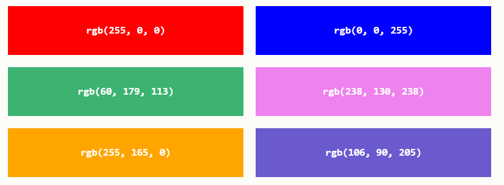
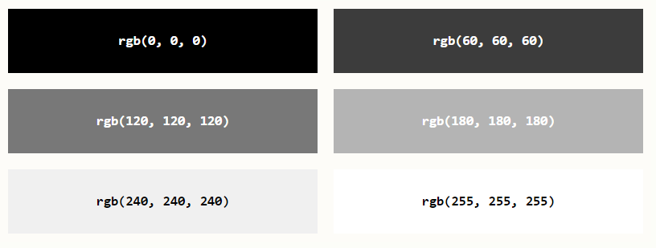
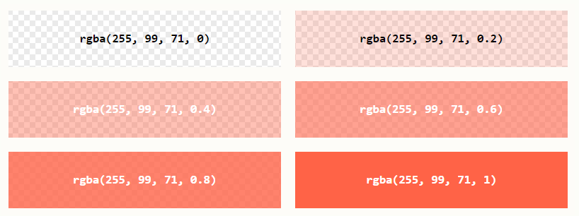
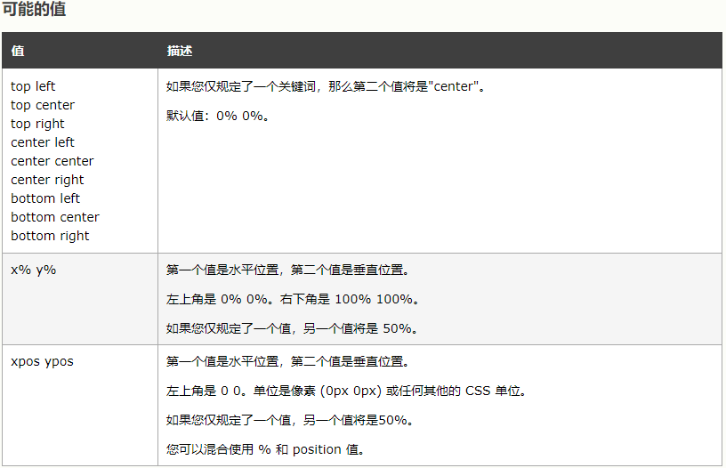

# CSS
## 优先级
* 大多数情况下都会直接使用外部样式，少数必要的地方也能使用内部样式。
* 内联样式如果没有足够的需要尽量不来使用，会增加维护工作，并很难更更新
* 网页在加载CSS样式的时候遇见错误的样式会直接跳过不处理
* 若样式冲突则按照下面的循序来进行适用
    * 浏览器是根据优先级来决定当多个规则有不同选择器对应相同的元素的时候需要使用哪个规则。
    > PS:在使用复合属性的时候需要讲单属性来写在复合属性的后面，在前面会被覆盖掉 如：
    >
    > > margin:0;复合属性 margin-top:0;单属性
    * 它基本上是一个衡量选择器具体选择哪些区域的尺度：
        * 一个元素选择器不是很具体 — 会选择页面上该类型的所有元素 — 所以它的优先级就会低一些。
        * 一个类选择器稍微具体点 — 它会选择该页面中有特定 class 属性值的元素 — 所以它的优先级就要高一点。
    * 通用选择器 `(*)`，组合符 (*, >, ~, ' ')，和否定伪类 (:not) 不会影响优先级。
    > PS:但是在:not()内部声明的属性会影响优先级。 
    * 一个选择器的优先级可以说是由四个部分相加 (分量)，可以认为是个十百千 — 四位数的四个位数：
            * 千位： 如果声明在 style 的属性（内联样式）则该位得一分。这样的声明没有选择器，所以它得分总是1000。
            * 百位： 选择器中包含ID选择器则该位得100分。
            * 十位： 选择器中包含类选择器、属性选择器或者伪类则该位得10分。
            * 个位：选择器中包含元素、伪元素选择器则该位得1分。
##  层叠&继承
* CSS 为控制继承提供了四个特殊的通用属性值。每个CSS属性都接收这些值。
    * inherit
        * 设置该属性会使子元素属性和父元素相同。实际上，就是 "开启继承".
    * initial
        * 设置属性值和浏览器默认样式相同。如果浏览器默认样式中未设置且该属性是自然继承的，那么会设置为inherit 。
    * unset
        * 将属性重置为自然值，也就是如果属性是自然继承那么就是 inherit，否则和 initial一样
    > PS: revert (en-US)， 只有很少的浏览器支持。所以不用
### all
* 可以用于同时将这些继承值中的一个应用于（几乎）所有属性。
* 它的值可以是其中任意一个(inherit, initial, unset, or revert)。这是一种撤销对样式所做更改的简便方法，以便回到之前已知的起点
### !important
* 可以用来覆盖所有上面所有优先级计算，用于修改特定属性的值， 能够覆盖普通规则的层叠。
* 覆盖 !important 唯一的办法就是另一个 !important 具有 相同优先级 而且顺序靠后，或者更高优先级。
* 强烈建议除了非常情况不要使用它。 !important 改变了层叠的常规工作方式，它会使调试 CSS 问题非常困难，特别是在大型样式表中

## 选择器
* 选择器主要是用来查找或者选取要设置的HTML的元素
    * 选择器主要分为5类：
        1. [简单选择器](#简单选择器)（根据名称，id，类来选择元素）
        2. <a id="a1" href="#a2">组合器选择器</a>（根据元素之间的关系来选择元素）
        3. <a id="b1" href="#b2">伪类选择器</a>（根据特定状态选取元素）
        4. <a id="c1" href="#c2">伪元素选择器</a>（选择元素的一部分来设置其样式）
        5. <a id="d1" href="#d2">属性选择器</a>（根据属性或者是属性值来选取元素）
    > PS:选择器尽量不要超过3层，不利于以后的代码优化
### 简单选择器
#### 元素选择器
   * 直接以元素的名称来选择元素
#### id选择器
* 元素的ID在页面中是唯一的，所以ID选择器能选择一个唯一的元素
* 写法为#后面紧跟ID属性值
  
    > PS：ID名称和类名不能为数字开头
#### 类选择器
* 写法和ID选择器类似，在.后面紧跟元素的class属性值 
  
    > PS：HTML元素能引用多个类，如：`<p class="center large">这个段落引用两个类。</p>`
#### 全局选择器 
* 使用*号选择页面中所有元素
#### 并列选择器
* 使用，来同时选择多个元素，div,span,p


### <a id="a2" href="#a1">组合器选择器</a>
#### 后代选择器（空格 div p）
* 选择指定元素的后代中的所有元素或指定元素
* div p为选中div里的所有p标签
#### 子选择器（div > p）
* 选择指定元素的所有子元素
* 和后代选择器的区别是如果在指定的元素中有其他元素将指定的子元素包裹就无法选中，而后代则无视这条规则
* div > p为选择div里面第一层的所有p标签
#### 相邻兄弟选择器（div + p）
* 选择指定元素中的所有相邻的元素，但是前提是必须要指定元素和相邻元素一起才能生效
* div + p为选择所有相邻着div的p
#### 通用兄弟选择器（div ~ p）
* 选择和指定元素同级的所有指定元素，没有相邻兄弟选择器的限制,只要是同级就能选中
* div ~ p为选择div同级里的所有p，只对在div后的p有效

### <a id="b2" href="#b1">伪类选择器</a>
|            选择器         |            例子              |                      描述                      |
|            :----:             |            :----:             |                       :----:             |
| :active	                  | a:active                    |	选择活动的链接。                            |
| :checked	               | input:checked          |	选择每个被选中的 `<input>` 元素。 |
| :disabled	                | input:disabled          |	选择每个被禁用的 `<input>` 元素。  |
| :empty	                | p:empty                    |	选择没有子元素的每个 `<p>` 元素。|
| :enabled	               | input:enabled           |	选择每个已启用的 `<input>` 元素。  |
| :first-child	             | p:first-child               |	选择作为其父的首个子元素的每个 `<p>` 元素。|
| :first-of-type           |	p:first-of-type        |	选择作为其父的首个 `<p>` 元素的每个 `<p> `元素。|
| :focus                      |	input:focus               |	选择获得焦点的 `<input>` 元素。      |
| :hover                      |	a:hover                     |	选择鼠标悬停其上的链接。            |
| :in-range                 |	input:in-range        |	选择具有指定范围内的值的 `<input>` 元素。|
| :invalid                    |	input:invalid              |	选择所有具有无效值的 `<input>` 元素。|
| :lang(language)       |	p:lang(it)                 |	选择每个 lang 属性值以 "it" 开头的 `<p>` 元素。|
| :last-child                |	p:last-child               |	选择作为其父的最后一个子元素的每个 `<p>` 元素。|
| :last-of-type           |	p:last-of-type             |	选择作为其父的最后一个 `<p>` 元素的每个 `<p>` 元素|
| :link                         |	a:link                       |	选择所有未被访问的链接。             |
| :not(selector)          |	:not(p)                       | 选择每个非 `<p>` 元素的元素。         |
| :nth-child(n)	           | p:nth-child(2)            |	选择作为其父的第二个子元素的每个 `<p>` 元素。|
| :nth-last-child(n)     |	p:nth-last-child(2)    |选择作为父的第二个子元素的每个`<p>`元素，从最后一个子元素计数|
| :nth-last-of-type(n) |p:nth-last-of-type(2) |	选择作为父的第二个`<p>`元素的每个`<p>`元素，从最后一个子元素计数|
| :nth-of-type(n)        |	p:nth-of-type(2)      |	选择作为其父的第二个 `<p>` 元素的每个 `<p>` 元素。|
| :only-of-type           |	p:only-of-type          |	选择作为其父的唯一 `<p>` 元素的每个 `<p>` 元素。|
| :only-child               |	p:only-child             |	选择作为其父的唯一子元素的 `<p>` 元素。|
| :optional                  |	input:optional          |	选择不带 "required" 属性的 `<input>` 元素。|
| :out-of-range           |	input:out-of-range   |	选择值在指定范围之外的 `<input>` 元素。|
| :read-only                |   input:read-only       |	选择指定了 "readonly" 属性的 `<input>` 元素。|
| :read-write               |	input:read-write      |	选择不带 "readonly" 属性的 `<input> `元素。|
| :required                  |	input:required          |	选择指定了 "required" 属性的 `<input>` 元素。|
| :root                         |	root                         |	选择元素的根元素。                       |
| :target                      |	#news:target          |	选择当前活动的 #news 元素（单击包含该锚名称的 URL）|
| :valid                        |	input:valid               |	选择所有具有有效值的 `<input>` 元素。|
| :visited                     |	a:visited                  |	选择所有已访问的链接。              |


### <a id="c2" href="#c1">伪元素选择器</a>
* ::before
    * 在元素前插入内容和样式
* ::after
    * 在元素后插入内容和样式
    * 和:before都是行内元素
    > content:""; 只有拥有这个属性才能显示</br>
    属性值 content:" "attr(class)" " 可以获取元素的class属性追加元素的文本两侧</br>
    配合 **:empty** 可实现占位符效果 `p:empty::before{ cotent:"提示文本"}`
* ::first-line 选中第一行
* ::first-letter 选中第一个字符
* ::selection 匹配被鼠标选中的部分
    * 带 -moz- 的数字表示使用前缀的首个版本。
    * 只应用少量 CSS 属性：color、background、cursor 以及 outline
### <a id="d2" href="#d1">属性选择器</a>
#### 存否和值选择器
* [attr] 列：a[href]
    * 匹配带有一个名为attr的属性的元素——方括号里的值
* [attr="value"] 例：a[href="#"]
    * 匹配带有一个名为attr的属性的元素，其值正为value——引号中的字符串。
* [attr~="value"] 例：a[href~="#"]-`<a id="d2" href="d1#">`
    * 匹配带有一个名为attr的属性的元素，包含值为value——引号中的字符串
* [attr|="value"] 例：a[href|="#"]-`<a id="d2" href="#d1">`
    * 匹配带有一个名为attr的属性的元素，其值以value为开始或者为value
    > 值必须是完整或单独的单词，比如 class="top" 或者后跟连字符的，比如 class="top-text",但是class="topcontent"则不选中。

#### 子字符串匹配选择器
* [attr^="value"]
    * 匹配带有一个名为attr的属性的元素，其值开头为value子字符串
* [attr$="value"]
    * 匹配带有一个名为attr的属性的元素，其值结尾为value子字符串
    > ^和$值不必是完整单词！
* [attr*="value"]
    * 匹配带有一个名为attr的属性的元素，任何地方出现了value都可以
    > i 例子:[attr^="a" i] 告诉浏览器，要以大小写不敏感的方式匹配ASCII字符

## css属性
### 颜色
* 颜色可以通过来指定rgb,hex,hsl,rgba,hsla的值来进行实现
* rgb（red-红,green-绿,blue-蓝）
    * 每个参数 (red、green 以及 blue) 定义了 0 到 255 之间的颜色强度
    * 所有值为255最大为白色，最小则为黑色，0为最小值
    
    * 而三个值相等则通常是来定义灰色阴影的
    

* rgba（red,greed,blue,alpha）
    * 和rgb基本没有区别，增加了alpha透明属性
    * alpha参数介于0.0(完全透明)和1.0(完全不透明)之间的数字
    

* hex（#rrggbb）
    * rr（红色），gg（绿色），bb（蓝色）的值是介乎于00（0~9）和ff（a~f）之间的十六进制值
    * 00最小，ff最大
    * 和gba一样，用三个相同的值来定义灰色阴影（如：#3c3c3c）

* hsl（hue-色相，stauration-饱和度，lightness-亮度，alpha-透明度）
    * 色相是色轮上的度数（从 0 到 360）
        * 0（或 360）是红色，120 是绿色，240 是蓝色
    * 饱和度是一个百分比的值
    * 亮度也是一个百分比的值，0%是黑色（深色），100%是白色
### 不透明度
* opacity属性是设置整个元素的透明度
* 取值和alpha完全一致，例：opacity:0.6
### 背景
* background-color 指定元素的背景颜色，可以搭配颜色名和透明色opacity来使用
* background-image：url（"paper,png"）
    * 指定元素的背景图像，默认情况下图像会重复来覆盖整个元素
* background-repeat
    * 用来更改background-image属性设置的图像重复现象
    * background-repeat: repeat-x设置图像尽在水平方向重复，垂直将x改为y即可
    * 也可以使用background-repeat: no-repeat来取消掉重复现象
* background-position指定背景图像的位置，通常搭配no-repeat使用
    * `position: left(默认)/center/right top(默认)/center/bottom;`图片的位置
    * 例：`position:right 20px bottom 20px`
    * 用calc()方案把背景图片定位到距离底边 10px 且距离右边 20px 的位置
        ```
        	background: url("code-pirate.svg") no-repeat;
        	background-position: calc(100% - 20px) calc(100% - 10px);
        ```
      
> PS:通常搭配background-attachment: fixed;背景固定使用，才能保证该属性在 Firefox 和 Opera 中正常工作
* background-attachment决定图像是否跟随页面其余部分滚动
    * fixed（固定），scroll（滚动）
* background-clip规定背景的图片的定位区域
    * border-box 背景被裁剪到边框盒，在整个容器中显示（默认值）
    * padding-box  背景在内边距框（包含内容区域）显示。
    * content-box 背景在内容框区域显示。
* background-origin 相对于内容框来定位背景图像
    * border-box 以边框左上角为参照进行位置设置
    * padding-box  背景相对内边距框显示（默认值）
    * content-box 以内容区域左上角为参照进行位置设置图像
* background-size 规定背景图像的尺寸
    * length设置宽高，有两个值第一个为宽，第二个为高，只设置一个值剩下的为auto
    * percentage 以父元素的百分比来设置元素的宽高，第一位框第二位高，不设的值为auto
    * cover 将背景图片按原来的缩放比将整个容器铺满	可等比例缩
    * contain 将背景图片按照原来的缩放比，完整的显示到容器中,不确定是否会将容器填充满
### 边框
* border能设置元素边框的样式，宽度和颜色
* **border-style**指定边框类型
    * solid 实线 | dotted 点线 | dashed 虚线 | double 双边框 | groove 凹槽 | ridge 凸槽 | inset 3D凹槽 | outset 3D凸槽 | none 无边框 | hidden 隐藏边框
    * 能同时使用4种不同的边框类型来达到混合效果，顺序是上、右、下、左
* **border-width**指定四个边的宽度，顺序是上右下左
    * 可以将宽度设置为特定的大小（px，pt，cm，em为计量都可以）
    * 可以设置预定值--thin细线| medium 中粗线 | thick 粗线
* **border-color** 设置边框的颜色
    * 能通过指定颜色名和HEX、RGB、HSL等方式设置颜色
        * transparent 边框透明
    > ps: 如果没有设置边框的颜色就会直接继承元素颜色
* border-top| right| bottom| left 单独的四个边
    * 边框的任意属性，比如类型颜色和宽度都能设置多个值
        * 设置一个则上下左右全部一致，两个值则上下一致，左右一致，设置三四个值按照上右下左的顺序设置
* 边框圆角 -- border-radius：10px；
* box-shadow:0px 0px 10px red; 边框阴影
    * 第一个属性为设置x轴位置，第二个y轴，第三个模糊范围
* 
### 基本属性简写
* 背景属性简写
    * `background: #ffffff url("tree.png") no-repeat right top;`
    ```
    在使用简写属性时，属性值的顺序为：
    background-color
    background-image
    background-repeat
    background-attachment
    background-position
    ```
>PS:背景属性简写并不需要写全，只要按照顺序设置的值就行，这里没有使用background-attachment的值
* 边框属性简写
    * 简写顺序为宽度，类型和颜色，即`border: 5px solid red;`
    * 也能指定单个边来设置`border-left: 6px solid red;`
## 小方法
### 文字对齐
* 问题 : 在布局的时候需要将字数不同的行对其
* 方法,需要定宽的块元素,设置 text-align: justify
    * 还需要在内部包含一个行内块宽度百分百的元素,这里使用了 after

```
    span {
        display: block;	// 必要
        text-align: justify;  // 必要
        height: 26px;
        line-height: 26px;
        width: 100px;	// 必要
        margin-right: 5px;
    
        &::after {
            content: '';
            display: inline-block;	// 必要
            width: 100%;
        }
    }
```