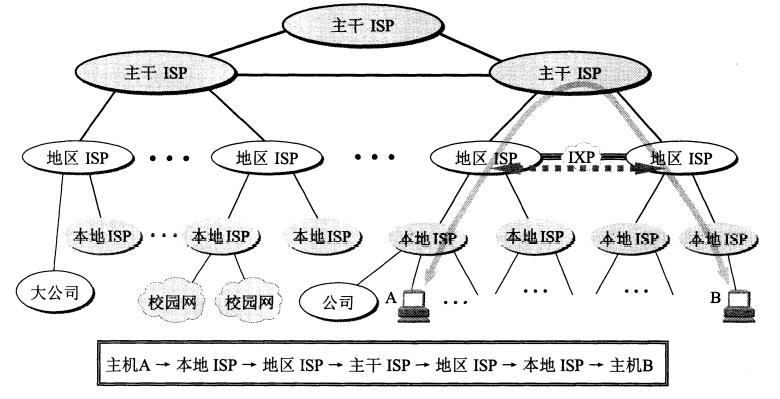
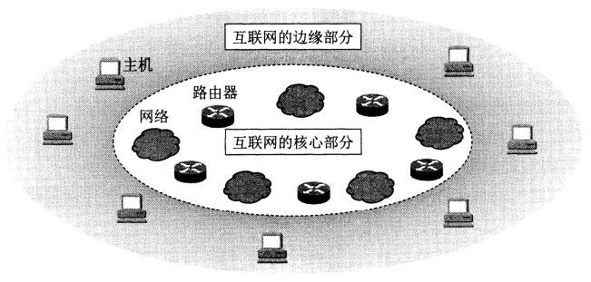

# 计算机网络
## 概述
### 计算机网络的作用
* 网络分为电信网络、有限电视网络和计算机网络
    * 电信网络为用户来提供电话、电报以及传真等服务
    * 有限电视机网络想用户传送电视节目
    * 计算机网络让用户能在计算机之间来传输数据文件
* 三种在信息化过程中都起到了很重要的作用，发展最快和起到核心作用的是计算机网络
    * 现在计算机网络也可以向大家来提供电话通信、视频通讯，电视节目传输等服务，这就是“三网融合”
* 计算机网络以Internet为代表得到了飞速的发展,Internet的中文译名不统一，比较广泛的有两种
    * 因特网这个名称是全国科学技术名词审定委员会推荐的，但是并没有得到长期推广
    * 互联网这是目前来说流行最广也是最标准的译名，多数的地方都是采用这个名字
        * internet是由数量极大的各种计算机网络互联起来的，也因此这个名字能体现出internet最主要的特征
> 而对于仅在局部范围内连接的计算机网络只能称之为互连网，而不是互联网
* 互联网能提供大家很方便的聊天、传输文件、购买物品、预约车票甚至是转账和买卖股票等应用
    * 而之所以能提供这么多服务，是因为互联网**连通性**和**共享**的基本特点
        * 连通性就是互联网上的用户不管相距多远，都可以便捷经济的交换信息，就像彼此直接连通的一样
            * 不用像电信网络一样提供连通性的同时，又要用户缴纳运行商的相关费用，特别是长距离通信
            * 而互联网也相应的具有虚拟的特点，即无法知道交流联通对方的真实身份和位置
        * 共享就是**资源的共享**
            * 可以是信息共享、软件共享，也能是硬件共享
    
* 人们在生活中越依赖互联网的便利性，互联网的可靠性和安全性也就越重要，互联网现在是社会最重要的基础设施

* “互联网+”，它的意思是互联网+各个传统行业
    * 所以可以利用信息通信技术和互联网平台来创造新的发展生态
    * 互联网+也是一种新的经济形态，特点是将互联网的创新成果深度的融合进经济社会的各领域之中，来大大提升实体经济的创新力和成产力
    * 互联网的各种应用也对各个行业造成了巨大的冲击，比如传统邮件电报和长途电话都急剧下降
    
* 当然互联网的发展也带来了一些负面的发展，比如利用计算机病毒来破坏互联网数据的正常传输和交换、网上欺诈或者沉迷网络游戏等

    

### 互联网概述
#### 网络
* 互联网是起源于美国，现已发展成世界上最大的覆盖全球的计算机网络
* 计算机网络（简称为网络）
    * 由若干结点（不标准称呼为节点）和链接这些结点的链路组成
    * 网络中的结点可以是计算机、集线器、交换机或路由器
    * 能提供**数据传输，资源共享，分布式处理，提高可靠性，负载均衡**等服务
    * 计算机之间能通过链路来连接集线器（结点）构成一个简单的计算机网络
        * 而这样的网络之间还能通过路由器来连接起来，构成覆盖范围更大的网络，这样的网络就成为互连网
        * 网络是把许多的计算机连接到一起，互连网则把许多的网络来通过路由器连接在一起，而连接网络的计算机成为主机
            * 也能把连接在计算机网络上面的智能手机称之为主机
            
            
#### 互连网结构发展的三个阶段
1. 单个网络想互连网发展的过程
    * 1969年美国国防部创建的第一个分组交换网ARPANET（并不是一个互连的网络）
        * 所有连接在分组交换网上的主机都是直接于就近的节点交换机相连的
        * 20世纪70年代ARPA（美国国防部）开始研究多种网络相连的技术，这就导致了互连网的出现，成为了互联网的雏形
        * 1983年TCP/IP协议成为了ARPANET上的标准协议，是所有使用TCP/IP协议的计算机都能利用互连网通信
            * **所以1983年是互联网诞生的时间**，ARPANET在1990年正式关闭
    * **internet和Internet的区别**
        * internet（互连网）是一个小写i开头的通用名词，泛指多个计算机网络互相连接
            * 且这些网络之间的通信协议可以任意选择，不一定非要选择TCP/IP协议
        * Internet（互联网）是大写的I开头的专用名词，他指的是全球当前最大的、开放的、由众多网络相互连接而成的特定互连网，采用的是TCP/IP协议作为通信的规则，前身是美国的ARPANET
    * 所以将几个计算机网络采用任意的协议来连接起来，并能够互相通信是构成的一个互连网（internet）而不是互联网（Internet）
2. 三级结构的互联网
    * 1985年美国国家科学基金会NSF围绕六个大型的计算机中心建设计算机网络，即国家科学基金网NSFNET
    * 这是一个三级计算机网络，分为主干网、地区网和校园网（或者企业网）
        * 1991年，NSF开始扩大互联网的使用范围，让其不仅仅用于大学和研究机构
        * 1992年互联网上的主机超过了100万台
        * 1993年互联网主干网的速率达到了45Mbit/s（T3速率）
3. 多层次ISP结构互联网
    * 1993年由美国政府资助的NSFNET逐渐被若干个商用的互联网代替
      * 政府机构也就不再负责互联网的运营，而出现了**互联网服务提供者ISP**（互联网服务提供商）比如中国移动、联通等
      * ISP可以从互联网管理机构中来申请IP地址（互联网上主机都必须拥有IP地址才能上网），同时拥有自己的通信线路
        * 所以上网就是通过某个ISP获得的IP地址来接入到互联网
        * IP地址的管理机构不会分配单个IP地址，只会批发地址
          * 所以现在的互联网是有全世界所有的ISP所共同拥有的，这就是互联网也被称为“网络的网络”的原因
      
    * 根据提供服务的覆盖面积及拥有的IP地址数不同，分为主干ISP、地区ISP、本地ISP
      * 主干ISP是由几个专门的公司创建和维持，服务面积大能覆盖国家范围，还拥有高速主干网高达10Gbit/s或更高
        * 有一些地区的ISP网络也能和主干网络直接连接
      * 地区ISP是一些计较小的ISP，这些ISP通过一个或者多个主干ISP连接，位于等级的第二层，数据率也比较低
      * 本地ISP是给用户提供的直接连接的服务（称为端用户，也就是末端的用户）
        * 本地ISP可以连接到地区ISP也能直接连接到主干ISP中，绝大多数用户都是连接的本地ISP
        
        * 本地ISP可以是一个仅仅提供互联网服务的公司、也可以是一个拥有网络并向自己的雇员提供服务的企业、或者是运行自己的网络的非盈利机构（大学或者是学院）

        
      
    * 每一个本地的ISP都安装路由器连接到某个地区ISP，地区ISP则也有路由器连接到主干ISP

      * 通过这种结构就能完成互联网中的分组转发任务

    * **互联网交换点IXP**是为了更快的转发分组和更有效的利用网络资源而诞生的

      * 主要作用是允许两个网络直接相连并交换分组，不再需要第三方的网络来转发分组
      * 简单来说将上图中的主机A和B通过IXP连接起来就不需要在通过最上层的主干ISP，直接就能使用高速链路来对等的交换分组
      * 能合理的分布互联网上的数据流量和减少分组转发的延迟时间
      * 本地ISP之间通过IXP对等交换分组的时候是不需要收费的，本地或者地区ISP通过IXP向高层转发分组就需要缴纳费用
      * 典型的IXP由一个或者多个网络交换机组成，许多ISP连接到这些网络交换机相关端口上
        * IXP常采用工作在数据链路层的网络交换机，这些交换机都是用局域网互联

    * 1995年世界上最大的IXP建造于德国的法兰克福，名字是DE-CIX [W-DECIX]，巅峰吞吐量在2015年9月达到4.859Tbit/s。成为互连网在欧洲的枢纽

    * 互连网在20世纪90年代发展迅猛，欧洲原子核组织CERN开发的万维网被广泛的运用在互连网上
#### 互连网标准化工作

* 互连网国际标准的制定是面向公众的，开放式的方式对互联网的发展影响巨大

* 1992年互联网不在归美国政府管理，所以成立了互联网协会ISOC

  * ISOC下负责管理互联网有关协议的开发技术组织为互联网体系结构委员会IAB，IAB下有两个工程部
    * 互联网工程部IETF
      * 由许多工作组组成的论坛，由互联网工程指导小组IESG管理工作
      * 工程主要针对协议的开发和标准化
    * 互联网研究部IRTF
      * 由研究组组成的论坛，由互联网研究指导小组IRSG负责具体工作管理
      * 任务是研究长期考虑的互联网相关的协议、应用和体系结构等
  * 互联网标准为RFC形式在互联网上发表，“RFC”为请求评论的意思
    * 制定互联网正式标准的三个阶段
      * **互联网草案**，有效期只有六个月，期间还不能算是RFC文档
      * **建议标准**，从这个阶段开始就成为RFC文档
      * **互联网标准**，达到正式标准会分配一个编号，即RFCxx（为数字），一个标准可以和多个文档关联

  

### 互联网组成—电路报文分组、客户服务器

* 互联网的拓扑结构很复杂，在地理上覆盖了全球，但可以分为两大块

  * 边缘部分——由所有连接到互联网上的主机组成，这部分用户能直接使用，来进行通信(传送数据、音频和视频)和资源共享

  * 核心部分——由大量网络和连接网络的路由器组成，为边缘部分提供服务(提供连通性和交换)

#### 互联网边缘部分

* 互联网边缘的部分就是连接在互联网上的所有主机
  * 这些主机称为端系统，即互联网的末端
  * 普通个人电脑和智能手机，甚至是一个网络摄像头或者大型计算机都可以是端系统
  * 边缘部分利用核心部分所提供的服务，使众多的主机之间互相通信并交换或共享信息
* 网络边缘端系统之间的通信方式为客户-服务器方式(C/S方式)和对等方式（P2P方式）

1. **客户-服务器方式**

   * 传统的互联网方式，发送电子邮件和网络查找资料都是使用的客户-服务器模式

   * **计算机之间的通信**并不是计算机之间通信，而是计算机之间的程序或者进程通信

   * 这里根据需求两个联通的主机之间任何一个都可以是客户或者是服务器

     * **客户是服务请求方， 服务器是服务提供方**，都要使用网络核心部分提供的服务

       `一、客户程序`
       
        * 被用户调用之后运行，通信时主动向服务器发起通信（请求服务），客户程序必须知道服务器程序地址
        * 不需要特殊硬件和复杂的操作系统
       
       `二、服务器程序`
       
        * 专门来提供某种服务的程序，能同时处理多个远地或本地用户的请求
        * 需要系统启动之后一直运行，被动的接受来自各地客户的请求，不需要知道客户程序的地址
        * 需要有强大的硬件和高级的操作系统支持

2. 对等连接模式（简称P2P）

   * 指两台主机在通信时不区分哪一个是服务请求方和服务提供方
   * 需要两台主机运行对等连接软件，来让双方都能下载对方储存在硬盘中的共享文档，这叫做P2P方式
   * 能同时支持大量的对等用户，每一台主机既能提供服务又能发送请求

#### 互联网核心部分——交换原理（电路、报文、分组）

* 核心部分需要向边缘部分的大量的网络主机提供连通性

* 网络核心起作用的是路由器，是一种专用计算机，来实现分组交换的关键构建
  * 任务是转发收到的分组，这是网络核心部分最重要的功能
  
* **电路交换**

  * 电话问世不就发现将所有电话机之间两两连接是不现实的，若两个电话机互相连接需要1根线，5部则是10根

    * 极大的占用了资源，而且随着电话机的数量增长，电线的数量也是急剧的激增

    * 所以交换机就诞生了，每部电话都连接到交换机上，就能让电话简彼此交换，电话交换机一直是电路交换

      

  * **交换**就是按照某种方式动态的分配传输的线路中的资源

    * 电路交换通话之前，需要先拨号来进行建立连接，用户听到交换机送来的振铃音并摘机后，就形成了一条**专用的物理通路**
    * 这条物理通路会在双方通话的时候一直被占用，不会再接到其他电话的连接请求，直到通话结束挂机之后才会释放这条物理通路
    * 这种通过建立连接（占用资源）→ 通话（一直占用资源）→ 释放连接（归还通信资源）的三个步骤就是**电路交换**

  > 使用电路来传输计算机数据的时候，传输效率很低，计算机数据是突发式的出现在传输线路上的
  >
  > 线路上用来传输数据的时间往往就不到10%甚至1%，被用户占用的通信线路往往都是空闲的，白白浪费资源

* **分组交换**

  * 将一个报文划分为几个分组之后再传送

  * 将数据段报文分成一个个小的等长数据段，在每个数据段上加入必要的控制信息来组成首部，就构成了分组

    * 分组也可以成为“包”。分组的首部也能成为“包头”
    * 分组是在互连网中传输的数据单元，分组中的包头是非常重要的，包含了目的地址、原地址等重要控制信息

    * 每个分组头部拥有了重要的控制信息之后就能单独的来选择传输路径，并正确的交付到分组传输终点

  * 位于网络边缘的主机和网络核心的路由器都是计算机，但作用不同

    * 主机是用来为用户进行信息处理的，可以和其他主机通过网络交换信息
    * 路由器则是用来转发分组，进行分组交换的
      * 收到一个分组后线储存，人后检查包头中的重要信息，获取转发表，来按照包头中的目的地址找到合适的借口来转发出去，交给下一个路由器
      * 这样一步步通过储存转发的方式来将所有分组送到最终目的地

  * 分组交换的时候将网络（路由器和路由器，主机于路由器之间的线路）可以简化为一条条链路，路由器就是结点

    * 通过分组交换可以在链路通信量太大或者是某些结点或链路突然出现故障的时候，能自动（通过路由选择协议）的找到转发分组最合适的路径

    

* **报文交换**

  * 通常我们把要发送的一整快数据成为报文,传输到相邻的结点，全部存储下来之后来查找转发表，转发到下一个结点
  * 和分组交换不同的一点是不会将数据进行分组

* 三种交换方式的特点和区别

  * 分组交换在路由器中储存转发的时候需要排队，会造成**时延**，所以需要尽量的减少时延

    * 而且由于分组和报文不像电路那样通过建立连接来保证通信是所需的各种资源，因此无法确保通信时端到端所需的带宽
    * 分组交换各分组需要携带的控制信息也是会造成一定的开销的，分组交换网需要专门的管理和控制机制

    

  * 三种交换方式主要特点

    * 电路交换建立连接，比特流持续从源点直达终点，就像在管道中传输；
    * 报文交换不建立连接，将整个数据（报文）逐步通过查找转发表到下个结点来到达终点，报文交换由于不分组只有一个包头；
    * 分组交换，将数据分成多个分组，单个分组传输到相邻结点，储存后查找转发表，到达下一个结点，最后逐渐到达终点

  * 所以若要建立大量连接，且其传输时间远大于建立连接的时间，则电路交换传输速率较快，报文交换和分组交换不需要预先分配宽带，传输突发数据可以提高整个网络的信号通路利用率

    * 由于一个分组长度远远小于整个报文的长度，所以分组交换比报文交换时延小，也就是更快，也具有更好的灵活性

### 我国计算机网络的发展

* 1980年我国铁道部开始计算机网络的实验
* 1989年11月我国第一个公用分组交换网CNPAC建成运行
  * 在20世纪后期公安、银行和军队以及一些其他部门相继建成了各自的专用计算机广域网
  * 20世纪80年代起，国内的许多单位也开始相继安装了大量的局域网，便于开发管理和维护
* 1994年4月20日我国用64kbit/s专线正式的接入互联网，同年的5月中旬中国科学院高能物理研究所设立了我国第一个万维网服务器
  * 同年9月中国公用计算机互联网CHINANFET正式启动
* 我国目前为止互联网基于互联网技术建造的能和互联网互联的多个全国范围内的公用计算机网络有5个
  * 分别是中国电信互联网 CHINANET | 中国联通互联网 UNINET | 中国移动互联网 CMNET | 中国教育和科研计算机网 CERNET | 中国科学技术网 CSTNET
* 2004年2月，我国第一个下一代互联网CNGI的主干网CERNET2试验网正式开通并提供服务，以2.5~10Gbit/s的速度连接北京和上海广州
* 1996年，张朝阳创立了中国第一家风险投资资金建立的互联网公司--爱特信，两年后爱特信推出了搜狐产品更名为搜狐公司，是国内的首家大型分类查询搜索引擎，1999年搜狐增加了新闻机内容频道成为了综合门户网站
* 1997年丁磊创立了网易公司。推出了中国第一年中文全文搜索引擎，推出的操蛋容量邮箱安全性很好，已成为国内最受欢迎的中文邮箱
* 1998年，王志东创立新浪网站，现已成为全球最大的中文综合网站
  * 同年马化腾、张志东创立了腾讯公司
  * 1999年腾讯推出了个人电脑上的即时通讯软件QQ，2011年推出了微信
* 2000年，李彦宏和徐勇出啊报告建立百度网站，现已成为全球最大的中文搜索引擎
* 1999年，马云创立的阿里巴巴网站，是一家企业对企业的网上贸易市场平台，2003年马云创立了淘宝网，2004年阿里巴巴集团创立了第三方支付平台支付宝

### 计算机网络的类别

#### 计算机网络定义

* 计算机网络主要是由一些通用的、可编程的硬件互相连接而成的，这些硬件能用来传送多种不同的数据类型，且支持多种广泛的和日益增长的应用
  * 计算机网络中连接的硬件，不限于一般的计算机包括了智能手机
  * 计算机不是专门用来传输数据的，而是能支持很多种应用

#### 不同的计算机网络类别

* 按照网络的作用范围分类
  * 广域网
    * 作用范围很广，通常为几十到几千公里，所以有时也称为远程网,能跨越不同的国家
    * 通过长距离运送主机发送的数据，连接广域网的结点交换机的链路都是高速链路，具有很大的通信容量
  * 城域网
    * 作用范围一般是一个城市，作用范围约为5~50km
    * 可以为一个或者几个单位来拥有，可以作为一种公用的设施来互联多个局域网，很多城域网都采用的以太网技术，所以也时常并入局域网范围讨论
  * 局域网
    * 用户与微型计算机或者工作站通过高速通信线路相连速率为1Mbit/s，范围为1km左右
    * 学校或者企业里面的局域网可以称为校园网和企业网
  * 个人区域网
    * 个人工作的地方使用的地方把个人的电子设备用无线技术连接起来的网络，范围为10m左右
    * 若中央处理器之间的距离非常的近，1m或者更小的范围内，就称为多处理系统，而不是计算机网络
* 按照使用者进行分类
  * 公用网
    * 电信公司（国有或私有）出资建造的大型网络，所有按照电信公司规定缴费的人都能使用的网络，也能成为公共网
  * 专用网
    * 某个单位或者部门为特殊业务工作建造的网络，不向本单位以外的人提供服务，例如军队、铁路、银行等
* 将用户接入到互联网中的网络
  * 接入网
    * 称为本地接入网或者居民接入网，接入网本身既不属于互联网核心部分，也不属于边缘部分
    * 是由某个用户端系统到互联网中的第一个路由器（边缘路由器）之间的网络
    * 覆盖范围属于局域网，主要是让用户能够于互联网之间起到桥梁的作用

### 计算机网络性能—带宽，时延，往返时延

* 计算机网络的性能一般是指它的几个重要的性能指标，还有一些非性能特征也对计算机网络性能有很大影响

#### 计算机性能指标

1. 速率

   * 计算机发出的信号都是二进制的数字，一个比特bit就是二进制数字中的一个0或者1
   * 速率指的是数据的传送速率，通常称为数据率和比特率
   * 速率的单位是bit/s（或b/s），还有Kbit/s、Mbit/s和Gbit/s
   * 网络的速率往往指的是额定速率或标称速率，并非是网络实际运行的速率，即指规定时间内传输的数据量

2. 带宽—具有一下两种不同的意义

   (1)意思是信号具有的频带宽度，信号的带宽指的是信号所包含的各种不同频率成分所占据的频率范围

   * 电话信号标准带宽为3.1KHz，这种带宽的单位是赫，千赫等，很长的时间内通信的主干线路传送的是模拟信号会持续变化的信号
   * 表示信道允许通过的信号频带范围就称为信道的带宽

   (2)还能用来表示网络中某通道传送数据的能力，表示在单位的时间内网络中某信道所能通过的最高数据率

   * 这种意义上的带宽的单位就是数据率的单位bit/s，是比特每秒

   * 这两种表述方式，前者为频域，后者为时域，但是本质都是相同的，即通信链路的带宽越宽，所能传输的最高数据率就越高

3. 吞吐量

   * 表示在单位的时间内通过网络的实际数据量
   * 吞吐量受网络的带宽和额定速率所限制
   * 吞吐量还能用每秒传送的字节数或帧数来表示

4. 时延

   * 数据从网络的一段到另一端所需要的时间。时延一般是由下面几个部分组成的

     1. 发送时延——主机或路由器发送数据帧所需要的时间

     2. 传播时延——电磁波在信道中传播所花费的时间

     3. 处理时延——主机或者路由器收到分组时进行处理的时间

     4. 排队时延——分组进入路由器的时候需要等待处理，到了转发接口之后还要在输出队列中等待，网络通信量较大的时候，可能会丢失分组，排队相当于无穷大

   * 当数据在高速的链路中传输的时候，提高的仅仅只是数据发送的速率，并不是传播速率

5. 时延带宽积

   * 是由传播时延和带宽相乘得出来的
   * 是以比特为单位的链路长度

6. 往返时间RTT

   * 互联网上的信息传输不仅仅是单项的也可以是双向交互的
     * 而得知双向交互一次所需要的的时间，能知道数据的有效数据率
   * 往返时间之中还包括有处理时延和发送时延，是一个很重要的数据指标

7. 利用率

   * 信道利用率
     * 指出某信道有百分之几的时间是被利用的
     * 而完全空闲出来的信道利用率是0
     * 信道的利用率太高就会导致改性到的时延增大，所以利用率不是越高越好的
   * 网络利用率
     * 而网络的利用率达到器容量的1/2的时候，时延就会加倍
     * 而当网络的利用率接近100%时就，时延就会无限接近于无穷大

#### 计算机网络非性能特征

1. 费用
   * 网络的价格总是必需考虑的，网络的性能于其价格密切相关，价格越高网络速率就越高
2. 质量
   * 网络质量是由网络中的构件决定的，以及这些构件是怎样构成网络决定的
   * 质量是直接影响到网络的可靠性、简易性和性能的
   * 网络的性能和质量不能看作同一性质
3. 标准化
   * 网络的硬件和软件最好是采用国际的标准，
   * 但是也可以遵循特定的网络标准
4. 可靠性
   * 是由网络的质量和性能来取决的一种性质
   * 高速网络的可靠性一般会更加的高，但是维持这种稳定性难度也会比普通网络增加
5. 可拓展性和可升级性
   * 网络的构造一般是会需要拓展规模的，也有升级性能和版本的需要
   * 这时候就需要在构造网络的时候考虑到网络的拓展性和升级性
   * 性能越高，网络的拓展费用也就越高
6. 易于管理和维护
   * 良好的管理和维护能保持网络的性能

### 计算机网络体系结构

* 网络的分层次体系结构是最基本的

#### 体系结构形成

* 两个连在网络上的计算机之间想要互相传送文件，除了必须要有一条传数据的通路外，还要有一下工作
  1. 发起通信的计算机需要激活通路，发送信令来保证传送的计算机数据能被正确的接收和发送
  2. 告诉网络要如何来识别接收数据的计算机
  3. 发起通信的计算机需检测对方计算机开机并网络畅通
  4. 对方计算机中文件管理系统是否已经做好接收文件和存储文件的准备
  5. 文件格式不兼容，至少其中的一台计算机需要来完成格式转化
  6. 出现数据传输错误、重复或丢失等意外事故，网络中结点交换机出现故障等，要有可靠的措施保证对方最终接收正确的文件
* 由此可见互相通信的计算机系统必须高度协调工作，但是协调很复杂，因此在最初的ARPANET提出了分层方法
  * 能将庞大而复杂的问题转化为若干较小的局部问题，比较易于研究处理
* 1974年，美国的IBM公司宣布了**系统网络体系结构**SNA，这个网络的标准就是按照分层方法制定的
* 1977年成立了专门的机构来研究不同的网络体系结构的互连
  * 随后他们提出了著名的**开放系统互连基本参考模型**OSI/RM简称OSI，只要遵循OSI标准，一个系统就可以和世界上任何一个也遵循这个标准的系统进行通信
  * 这里的系统是在现实系统中于互联有关的各个部分（并不是一个系统中的所有部分都与互连有关）
  * 1983年形成了开放系统互连基本参考模型的正式文件，即著名的ISO国际标准，也就是**七层体系结构**
* 但是OSI却在市场化的方面上失败了，由于TCP/IP抢先在全球很大的范围内成功运行了，而且未采用OSI标准
  * 再者OSI协议实现起来太过复杂，运行效率也很低，层次划分不合理等问题所以OSI只获得了理论上的研究成果

#### 协议于划分层次

* 网络中交换数据需要遵守一些约定好的规则，这些规则明确的规定了交换数据的格式和有关的同步问题
  * 这里同步不是同频或者是同频同相，而是包含有时序的意思
* 这些为了网络中数据交换而建立的规则标准或者约定则叫做**网络协议**，主要由三个要素组成
  * 语法，数据和控制信息的结构和语法
  * 语义，需要发出何种控制信息、完成何种动作和做出何种响应
  * 同步，事件实现的顺序的详细说明
* 我们想要连接网络上的另一台计算机就需要协议，只在自己的电脑上操作则不需要任何网络协议
* 通常协议有两种表现形式，一种是让计算机看的程序代码，另一种是便于人来阅读的文字
* 复杂的网络协议结构都应该是分层次的，而分成能带来很多好处
  * 各层之间的关系是独立的，每个层之间都只实现对应的一种功能，将整个问题的复杂度下降了
  * 灵活性好，当任何一个层发生变化都不会有其他的层收到影响，能随时的取消不需要的层功能
  * 结构上分开，各层都能用最适合的技术来实现
  * 易于实现和维护
  * 能促进标准化工作，每层的功能都会有相应精确的说明
* 分层需要每一层都非常精确，层数太少每层的协议就会很复杂，太多描述综合层会太麻烦，主要实现的功能是
  * **差错控制**，是相应层次的对等方通信更可靠
  * **流量控制**，发送段的发送速率必须让接收端来的及接收
  * **分段重装**，在发送时将数据在发送段分成小块，在接收段重组
  * **复用和分用**，发送端高层会复用一条低层的连接，在接收端分用
  * **连接建立和释放**，交换数据前建立一条逻辑连接，结束后在释放
* 计算机网络体系结构就是计算机网络及构件所应该完成功能的精确定义

#### <a href="#a1" id="a2">五层协议体系结构—TCP/IP体系结构、无连接面像连接</a>

* TCP/IP是一个四层的体系结构，包含应用层、运输层、网际层和网络接口层

* 五层协议是伪类介绍网络原理设计的，实际应用还是四层结构

  

* 应用层—消息、报文

  * 体系结构中的最高层，负责通过应用进程（主机中正在运行的程序）间的交互来完成特定网络应用
  * 定义的是应用进程间通信和交互的规则，应用层交互的数据叫做**报文**

* 运输层—数据段—**无连接面像连接**

  * 负责两台主机进程间的通信，并提供通用的数据传输服务

  * 通常利用该服务来传输应用层报文，多个应用能同时使用这个运输层服务

  * 所以有复用多个应用层进程同时使用运输层服务，然后再分用把运输层收到的信息分别交付上面的应用层

  * 运输层主要有两种协议

    1. 传输控制协议TCP—提供**面向连接**可靠的数据传输服务，传输单位是报文段
    2. 用户数据报协议UDP—提供**无连接**、尽最大努力的数据传输服务(不保证数据传输的可靠性)，传输单位是用户数据报

    > PS: **无连接**就是像QQ那样的连接，不需要双方同时在线，你发你的，他接他的，你只管把数据发出去就行．双方可以是同步，也可以是异步．这就是为什么你QQ上可以留言，别人几天后都用接到的原因
    >
    > 而**面向连接**需要建立连接、通讯、释放连接

* 网络层—分组、数据包

  * 负责分组交换网上不同主机提供通信服务
  * 将运输层产生的报文段或者用户数据封装成分组或包来传送
  * 分组也叫做**IP数据报**，简称为数据报，本书把分组和数据报作同义词来使用
  * **将协议数据单元PDU称之为分组的是网络层**
  * 第二个任务是找到合适的路由，让源主机运输层内传下来的分组能通过网络中的路由器找到目的主机
  * 互联网由大量的异构网络通过路由器互相连接起来，互联网网络层使用的协议是无连接的网际协议和多种路由器选择协议，因此网络层也称为网际层和IP层

* 数据链路层—帧

  * 常称为链路层，两台主机之间数据传输，需要专门的链路层协议。
  * 数据链路层将网络层交下来的IP数据报组装成**帧**，每一帧都包扣数据和必要的控制信息
  * 帧就是数据链路层的协议数据单元，它包括三部分：帧头，数据部分，帧尾

* 物理层—比特流（bit）

  * 物理层上传输单位是比特，比特是物理链路传输的0、1比特流
  * 物理层负责传输和识别对方发出的比特
  * **OSI参考模型将对等层次之间传送的数据单位称为该层的协议数据单元**

* 五层协议运行理解总结

  

* 在每一层都有一个信息传输单元，叫信息分组（即上面提到的分组一般性的意思），每层具体的协议数据单元PDU叫法是由最初始的信息分组在各层经过封装后形成的。
* 进入信息应用层(5)加上应用层的报头后成为最初始的信息分组，叫**信息**，由传输层(4)提供报文交付（下层为上层服务），应用层报文传到传输层。进入传输层，报文被分割固定长度，加上传输层报头，成为**数据段**。数据段向下传到网络层(3)，加上网络层报头，包含路由信息，成为**分组或数据报**，网络层实现分组交付。继续向下传输，进入链路层(2)，加上链路层头部和尾部，形成**帧**，将源自网络层来的数据可靠地传输到相邻节点的目标即物理层。进入物理层(1)，将数据转换成物理链路中模拟量即**bit**(0或1)进行传输，到达接收端是一个相反的过程。

#### 实体、协议、服务、服务访问点

* **实体**是表示任何可以发送或者是接收信息的硬件和软件进程，是一个特定的软件模块
* 而**协议**就是控制两个或者多个实体进行通信的规则的集合
* 运输层最重要的协议是TCP和UDP协议，而网络层则最重要的是IP协议
  * 协议的语法是可以规定交换的信息个数
  * 协议的语义则可以规定发送和接收者需要完成的操作
* 服务是在协议的控制和规定下，两个对等的实体间通信让本层能向上一层来提供功能（服务）
  * 而要实现本层的协议需要使用下一层提供上来的服务来完成
* 协议和服务在概念上是不一样的，协议是规定，能向上来提供服务，而服务则是能被上层看见的功能
  * 协议是**水平的** ，每一层的协议都是单独的，控制对等实体之间的规则
    * 服务是**垂直的**，是下层向上层通过层间接口提供的功能，一个层中不是所有的功能都是服务，只有能被上层实体看见的才是，上层使用下层提供的服务而与下层交换的命令这是在OSI中被称为**服务源语**
  * 使用本层服务的实体是只能看见下层提供上来的服务，而无法看见下面的协议的，下面的协议对上面来说是透明的
* 同一系统中相邻的两层实体进行信息交互的地方叫做**服务访问点**SPA,即像一个邮政信箱一样，能放入邮件和取走邮件
  * 这种层间的接口和两个设备间的硬件接口是不一样，不要弄混淆
* 而层与层之间交换的数据单位在OSI之中被称为**服务数据单元**SDU
  * 它与协议数据单元PDU是不一样的，多个SDU可以合成一个PDU，一个SDU也能分为几个PDU
* 下层的实体相对于上层的实体来说是**服务提供者**，上层实体相对于服务提供者又相当于**服务用户**，因为服务用户使用服务提供者提供的服务
  * 任何相邻的两层之间提供服务的下层实体都是服务提供者，反之上层实体这是服务用户
* 协议必须要把所有的不利条件都考虑到，不能假定一切都是正常或者是非常理想的
  * 计算机网络协议是否正确需要非常仔细的检查协议能不能应对各种不同的异常状况

#### TCP/IP的体系结构

* TCP/IP的体系结构比较简单只有4层，在上面<a href="#a2" id="a1">五层协议体系结构</a>有具体介绍
* TCP/IP协议族的特点是两头大而中间IP层很小，上层的各种协议都汇聚到一个IP协议中

* 这样的协议族表明TCP/IP协议可以为各式各样的应用提供服务
* 同时TCP/IP协议也允许IP协议在各式各样的网络构成的互联网上运行
* IP协议在互联网中起到了核心的作用

## 物理层

### 物理层的基本概念

* 物理层主要考虑的是怎样才能在连接各种计算机的传输媒体上传输数比特流，而不是具体的传输媒体
* 物理层的主要作用是屏蔽掉硬件设备和传输媒体之间的通信手段的差异，使物理层上面的数据链路层感受不到差异
* 用于物理层的协议称为**物理层规程**
* 物理层主要任务与传输媒体的接口有关的特性如下：
  1. 机械特性
     * 接口所用连接器的形状和尺寸、引脚数目和排列、固定、锁定装置等，各种规格的接插件都有严格规定
  2. 电气特性
     * 接口电缆的电压范围
  3. 功能特性
     * 某根线上出现电平的电压意义
  4. 过程特性
     * 对不同功能的各种可能事件出现的顺序
* 数据在计算机中采用的是并行传输方式，但在通信线路(传输媒体)中都是串行传输的传输方式
  * 即逐个比特按照时间的顺序传输，所以物理层还要负责传输方式的转转换

### 数据通信基础知识

#### 数据通信系统模型

* 一个通信系统可以分为三个部分，即**原系统**（发送方)、**传输系统**(传输网络)、和**目的系统**(接收方)

  

  * 这张图中的数据通信系统可以说是一个计算机网络，交数据通信系统主要是为了讲解数据通信的一些要素

* 原系统包扣两个部分

  * 原点—产生要传输的数据，如：从键盘中输入汉字，计算机产生输出数字比特流，原点又称为**源站**或**信源**
  * 发送器—原点生成的比特流要通过发送器来进行编码才能在传输系统中传输，典型的发送器是调制器

* 目的系统也有两个部分

  * 接收器—接收传输系统传过来的信号，转化为能够被目的设备处理的信息，典型的接收器是解调器
  * 原点—获取从接收器上传送过来的数字比特流，然后输出如：把汉字在计算机屏幕上显示出来，终点称为**目的**站或**信宿**

* 很多计算机都有内置的调制解调器（包含调制器和解调器），在计算机外看不见调制解调器

* 在原系统和目的系统之间的连接线路可以是普通的传输线，也能是连接在原系统和目的系统之间的复杂网络系统

